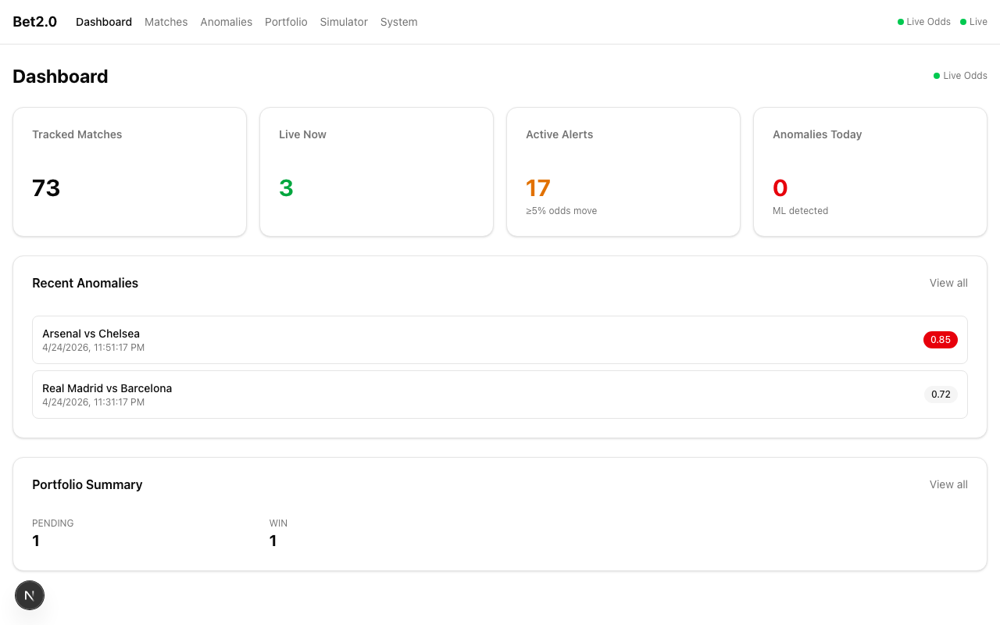
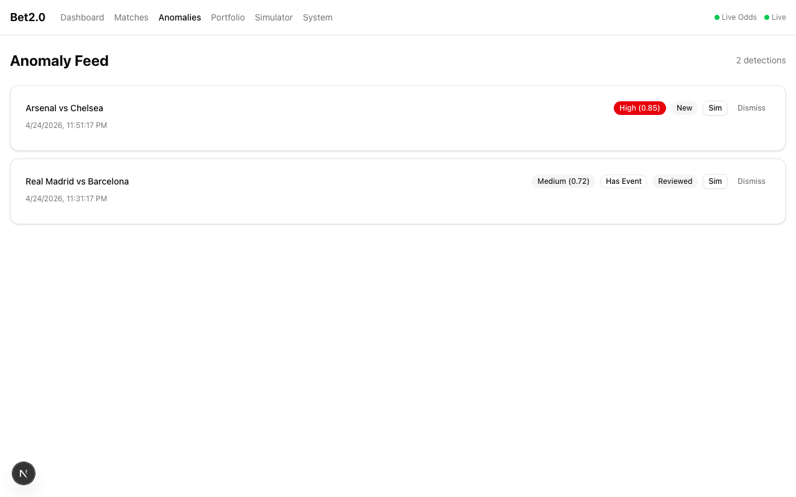
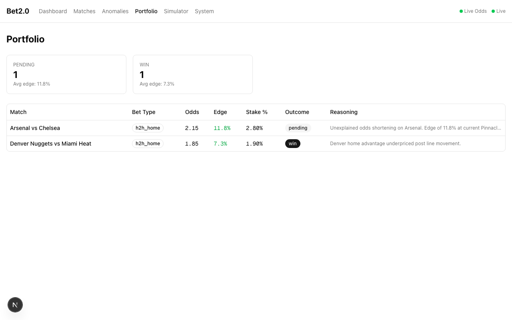
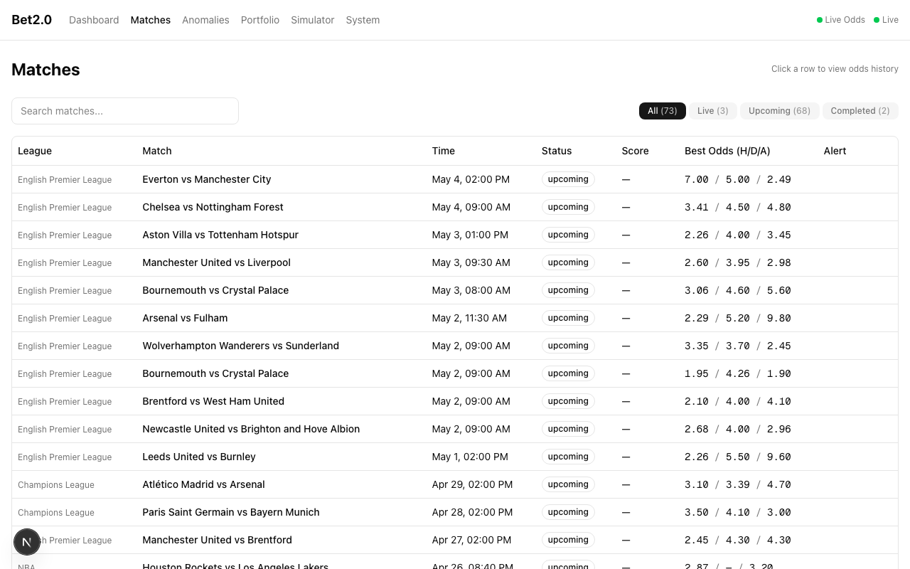
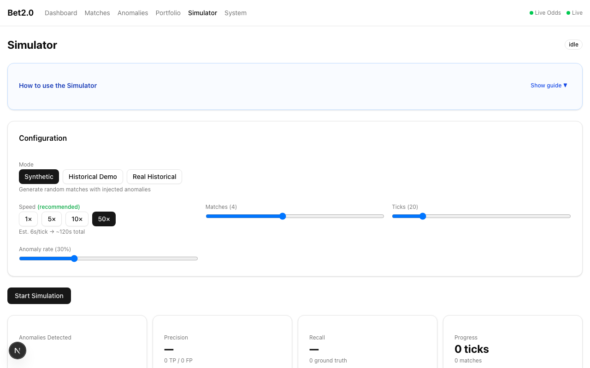
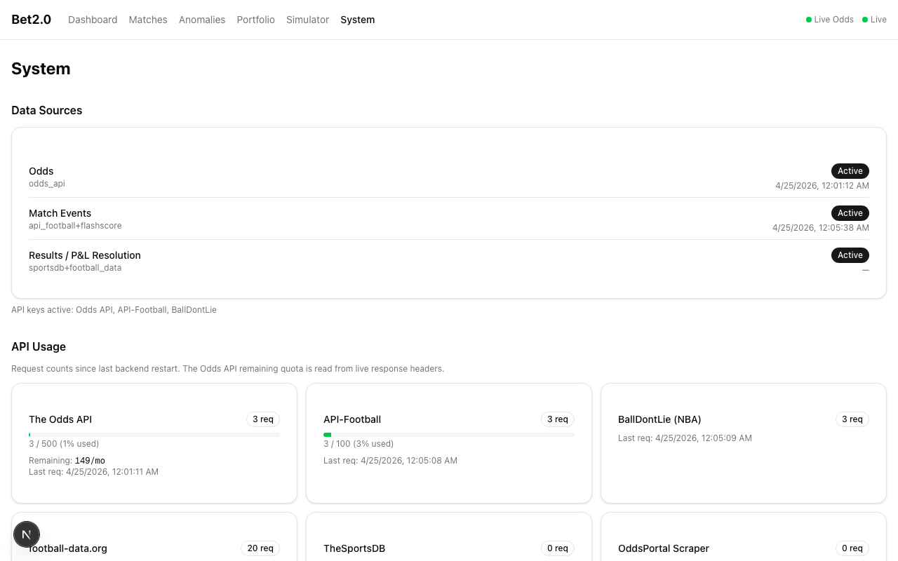

# Bet2.0 — Sports Betting Anomaly Detection

A full-stack ML application that monitors live odds across bookmakers, detects suspicious price movements using machine learning, and manages a betting portfolio with Kelly Criterion sizing.

The repo is private. This page exists to show what it does.

---

## What it does

Odds markets move for reasons: sharp money, insider information, or bookmaker repricing. Most of those reasons are noise — but some are signal. Bet2.0 automates the detection.

Every 5 minutes the system polls The Odds API across EPL, Champions League, and NBA. Each new odds snapshot runs through a two-stage ML pipeline:

1. **Isolation Forest** — scores each odds movement as an anomaly relative to historical variance
2. **Bayesian changepoint detection** — confirms structural breaks in the time series, not just noise

Detections with a match event (goal, card, VAR) within a 5-minute window are tagged accordingly. Everything else is a potential pre-match signal. Claude generates a plain-language explanation for each detection when an Anthropic API key is configured.

---

## Screenshots

### Dashboard — live with 73 tracked matches, 3 live, 17 active alerts

### Anomaly Feed — 2 detections: Arsenal vs Chelsea (High 0.85) and Real Madrid vs Barcelona (Medium 0.72)

### Portfolio — Half-Kelly sized positions with edge calculations

### Matches — 73 real EPL / Champions League / NBA matches with live best odds

### Simulator — Synthetic, Historical Demo, and Real Historical backtesting modes

### System — All data sources active with API usage tracking

---

## Tech stack

| Layer | Stack |
|-------|-------|
| Backend | FastAPI · Python 3.11 · SQLModel · asyncpg · APScheduler |
| ML | scikit-learn (Isolation Forest) · SciPy (Bayesian changepoint) |
| Database | PostgreSQL 16 + TimescaleDB |
| Frontend | Next.js 15 · TypeScript · Tailwind CSS · Recharts |
| AI | Claude API (Anthropic) — anomaly explanations |
| Infra | Docker Compose |

---

## Why it's private

The repo includes API keys scaffolding, scraper logic for live bookmaker data, and a backtesting framework. Keeping the code private avoids misuse. Screenshots and architecture are shared here to demonstrate the system.

---

Built by [Juan Pablo Bernal](https://github.com/Bernaljp)
